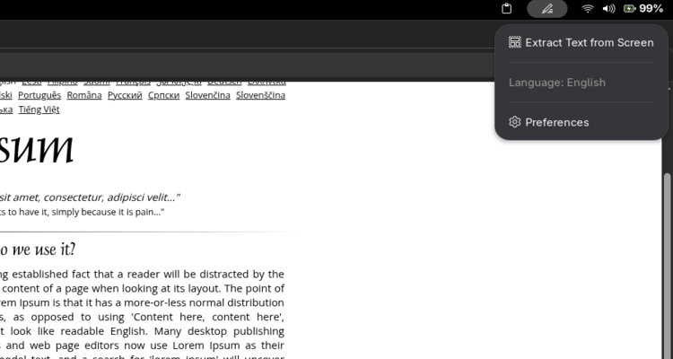

# Text Extractor - GNOME Shell Extension

A OCR text extraction tool for GNOME Shell that captures text from screen selections and copies it to the clipboard. Similar to PowerToys Text Extractor for Windows.

## Features

- 🖼️ **Screen Area Selection**: Select any area of your screen to extract text from
- 📋 **Clipboard Integration**: Automatically copies extracted text to clipboard
- 🌐 **Multi-language Support**: Supports English and Tamil (தமிழ்) languages
- ⚡ **Fast & Reliable**: Uses Tesseract OCR engine for accurate text recognition

## Screenshots


## Requirements

### System Dependencies
The extension requires the following packages to be installed:

- **tesseract-ocr**: OCR engine for text extraction
- **xclip**: Clipboard utility for copying text
- **gnome-screenshot**: Screenshot utility for capturing screen areas

### Optional Dependencies
- **tesseract-ocr-tam**: Tamil language pack (only if you need Tamil text recognition)

## Installation

### Method 1: Automatic Installation (Recommended)

1. **Download the extension**:
   ```bash
   git clone https://github.com/imshaaz21/text-extractor-gnome.git
   cd text-extractor-gnome
   ```

2. **Install dependencies automatically**:
   ```bash
   chmod +x scripts/install-dependencies.sh
   scripts/install-dependencies.sh
   ```
   This script will detect your Linux distribution and install the required packages.

3. **Install the extension**:
   ```bash
   # Copy to extensions directory
   glib-compile-schemas extension/schemas
   mkdir -p ~/.local/share/gnome-shell/extensions/text-extractor@imshaaz21.github.com
   cp -r extension/* ~/.local/share/gnome-shell/extensions/text-extractor@imshaaz21.github.com/

   # Restart GNOME Shell
   # Press Alt+F2, type 'r', and press Enter
   # Or log out and log back in
   ```

4. **Enable the extension**:
    - Open GNOME Extensions app
    - Find "Text Extractor" and toggle it on
    - Or use command line: `gnome-extensions enable text-extractor@imshaaz21.github.com`

### Method 2: Manual Installation

#### Ubuntu/Debian:
```bash
  sudo apt update
  sudo apt install tesseract-ocr tesseract-ocr-tam xclip gnome-screenshot
  sudo apt install tesseract-ocr-tam # Optional for Tamil support
```

#### Fedora:
```bash
  sudo dnf install tesseract tesseract-langpack-tam xclip gnome-screenshot
  sudo dnf install tesseract-langpack-tam # Optional for Tamil support
```


Then follow steps 3-4 from Method 1.

## Uninstallation
To remove the extension, run the following command:

```bash
  rm -rf ~/.local/share/gnome-shell/extensions/text-extractor@imshaaz21.github.com
  gnome-extensions disable text-extractor@imshaaz21.github.com
```

## Usage

1. **Quick Access**: Click the Text Extractor icon in the top panel
2. **Extract Text**: Select "Extract Text from Screen" from the menu
3. **Select Area**: Use your mouse to select the area containing text
4. **Get Results**: The extracted text will be automatically copied to your clipboard

### Menu Options

- **Extract Text from Screen**: Start the text extraction process
- **Language**: Shows currently selected OCR language
- **Check Dependencies**: Verify all required packages are installed
- **Preferences**: Configure language and display settings

## Configuration

### Language Settings
- Open the extension preferences to change the OCR language
- Currently supports:
    - English (eng)
    - Tamil (தமிழ்) (tam)

### Display Settings
- Toggle the panel indicator visibility


## License

This project is licensed under the [GNU General Public License v3.0](./LICENSE).
