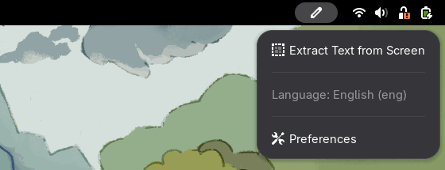
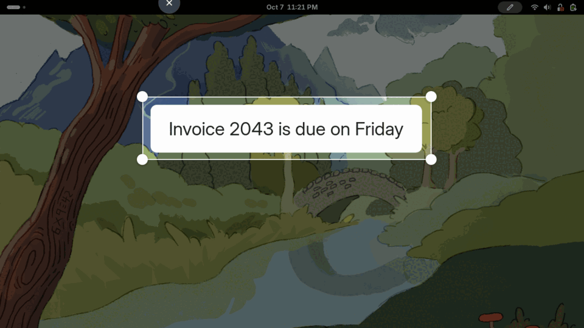
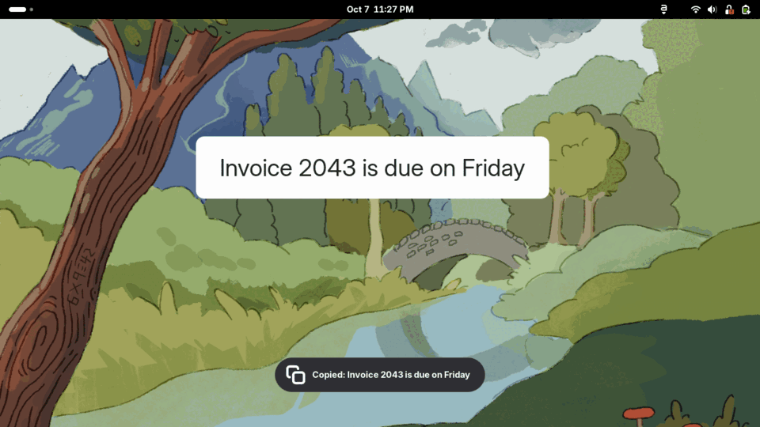

# Text Extractor for GNOME: OCR Screenshot to Text

[](LICENSE)

[](https://buymeacoffee.com/imshaaz)

A GNOME Shell extension for OCR on your screen: select an area, and the text in it (screenshot to text) is copied to the clipboard. It is the GNOME equivalent of PowerToys Text Extractor on Windows, and works with any language Tesseract supports.

| 1. Start | 2. Select | 3. Paste |
|:---:|:---:|:---:|
|  |  |  |
| Click the panel icon and choose Extract Text from Screen | Drag over the text, the capture happens when you let go | The text is on your clipboard |

## Features

- Uses GNOME's own screenshot overlay, reduced to area selection: the screen freezes, you drag, you are done
- Works with any language Tesseract has installed, and with several at once (`eng+tam`)
- Bring your own models: point the extension at a folder of `.traineddata` files
- Quiet: a short on-screen message on success, a notification only when something needs fixing
- Nothing is left behind: the temporary screenshot is deleted after reading

## Requirements

- GNOME Shell 45 to 50
- [Tesseract](https://github.com/tesseract-ocr/tesseract) and the language data you need

The extension does not install anything itself. When Tesseract or a language is missing, it tells you the exact command for your distribution, in the notification and in **Preferences → Text Recognition** (with a copy button).

| Distribution | Tesseract | A language, e.g. Tamil (`tam`) |
|---|---|---|
| Ubuntu, Debian | `sudo apt install tesseract-ocr` | `sudo apt install tesseract-ocr-tam` |
| Fedora | `sudo dnf install tesseract` | `sudo dnf install tesseract-langpack-tam` |
| Arch | `sudo pacman -S tesseract` | `sudo pacman -S tesseract-data-tam` |
| openSUSE | `sudo zypper install tesseract-ocr` | `sudo zypper install tesseract-ocr-traineddata-tam` |

## Adding a language

English works out of the box. To read another language:

1. **Find its Tesseract code**, for example `deu` (German), `tam` (Tamil), `sin` (Sinhala), `chi_sim` (Chinese, simplified). See the [full list](https://tesseract-ocr.github.io/tessdoc/Data-Files-in-different-versions.html).
2. **Install the language pack** with your package manager, using the table above. For Sinhala on Ubuntu: `sudo apt install tesseract-ocr-sin`.
3. **Open Preferences → Text Recognition**, press the refresh button, and tick the language. Tick several to read mixed-language text.

The extension lists whatever Tesseract has installed, so no extension update is needed for new languages.

### A language your distribution does not package

1. Download its `.traineddata` file from [tessdata_best](https://github.com/tesseract-ocr/tessdata_best) (best quality) or [tessdata_fast](https://github.com/tesseract-ocr/tessdata_fast) (faster).
2. Put it in a folder of your own, for example `~/tessdata`, together with `eng.traineddata` and any other language you still want. Tesseract reads one folder only.
3. In Preferences, enter that folder in **Tessdata folder** and press apply, then tick the language.

## Installation

1. **Install Tesseract** first, as described in [Requirements](#requirements). The extension does not install it for you.
2. **Install the extension**, either way:

   - From [extensions.gnome.org](https://extensions.gnome.org/extension/8240/text-extractor/): open the page and switch it on.
   - From source:

     ```bash
     git clone https://github.com/imshaaz21/text-extractor-gnome.git
     cd text-extractor-gnome
     make install
     ```

     Log out and back in, then enable it: `gnome-extensions enable text-extractor@imshaaz21.github.com`

## Uninstallation

1. **Remove the extension.** Use the Extensions app (**Remove**), or run `gnome-extensions uninstall text-extractor@imshaaz21.github.com`. If you installed from source you can also run `make uninstall`.
2. **Optional: reset its settings:**

   ```bash
   dconf reset -f /org/gnome/shell/extensions/text-extractor/
   ```

3. **Optional: remove Tesseract** if nothing else uses it. The extension never installed it, so it stays until you remove it with your package manager, for example `sudo apt remove tesseract-ocr` on Ubuntu or `sudo dnf remove tesseract` on Fedora. Language packs you added are separate packages.

## Usage

1. Click the Text Extractor icon in the top panel and choose **Extract Text from Screen**.
2. Drag over the text.
3. Paste it anywhere.

Press <kbd>Esc</kbd> to cancel.

## Preferences

| Setting | What it does |
|---|---|
| Languages | Tick one or more installed languages. Mixed-language text works when several are ticked. |
| Tessdata folder | Use your own `.traineddata` files, for example from [tessdata_best](https://github.com/tesseract-ocr/tessdata_best). Tesseract reads one folder only, so this **replaces** the system folder: put every language you need in it. |
| Show Panel Indicator | Hide or show the panel icon. |

## FAQ

**Is there a PowerToys Text Extractor for Linux?**
This extension does the same job on GNOME: you select an area of the screen and the text in it is copied to the clipboard.

**How do I copy text from an image or from the screen on Ubuntu, Fedora or Arch?**
Install Tesseract, install this extension, click its panel icon and drag over the text. The text is on your clipboard.

**Does it work on Wayland?**
Yes. It uses GNOME's own screenshot overlay, so it does not depend on X11 tools.

**Which languages does it read?**
Any language Tesseract has data for, including several at once. See [Adding a language](#adding-a-language).

**Does it send my screen anywhere?**
No. Recognition runs locally with Tesseract, and the temporary screenshot is deleted afterwards.

## Troubleshooting

**"Missing: ..." message.** Run the command it shows, then press the refresh button in Preferences.

**The text is wrong or empty.** Select a larger area and make sure the right language is ticked. Tesseract reads clean, high-contrast text best.

**Something else.** Open an issue with the output of `journalctl -f -o cat /usr/bin/gnome-shell` while you reproduce it.

## Development

```bash
make nested   # run the code in extension/ in a throw-away GNOME Shell
make pack     # build dist/*.shell-extension.zip
```

```
extension/
├── extension.js   panel menu, screenshot to text to clipboard
├── prefs.js       preferences window
├── ocr.js         Tesseract helpers shared by both
├── metadata.json
└── schemas/       GSettings schema
```

See [CONTRIBUTING.md](CONTRIBUTING.md) to get involved, [docs/README.md](docs/README.md) for debugging tips and [CHANGELOG.md](CHANGELOG.md) for release notes.

## License

[GNU General Public License v3.0](LICENSE)
