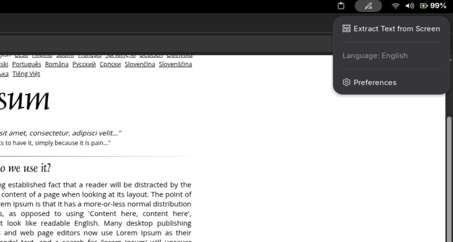

# Text Extractor - GNOME Shell Extension

[](LICENSE)

[](https://buymeacoffee.com/imshaaz)

Select any area of your screen and get its text on the clipboard. Like PowerToys Text Extractor, for GNOME.

## Features

- 🖼️ **Uses GNOME's own screenshot tool** to select the area
- 📋 **Copies the text to the clipboard**
- 🌐 **Any language** Tesseract supports. The list comes from what you have installed, so there is nothing to configure in the extension
- ⌨️ **Keyboard shortcut** (default <kbd>Super</kbd>+<kbd>Shift</kbd>+<kbd>T</kbd>, configurable)
- 🔀 **Mixed-language text**: tick several languages at once
- 🧩 **Bring your own models**: point the extension at a folder of custom `.traineddata` files



## Requirements

GNOME Shell 45 to 51, and [Tesseract](https://github.com/tesseract-ocr/tesseract).

The extension installs nothing itself. If Tesseract or a language is missing, **Preferences → Text Recognition** shows the exact command for your distribution, with a copy button.

| Distribution | Tesseract | A language (e.g. Tamil `tam`) |
|---|---|---|
| Ubuntu / Debian | `sudo apt install tesseract-ocr` | `sudo apt install tesseract-ocr-tam` |
| Fedora | `sudo dnf install tesseract` | `sudo dnf install tesseract-langpack-tam` |
| Arch | `sudo pacman -S tesseract` | `sudo pacman -S tesseract-data-tam` |
| openSUSE | `sudo zypper install tesseract-ocr` | `sudo zypper install tesseract-ocr-traineddata-tam` |

Language codes are Tesseract's (`eng`, `deu`, `tam`, `sin`, `chi_sim`, …); see the [full list](https://tesseract-ocr.github.io/tessdoc/Data-Files-in-different-versions.html).

## Installation

```bash
git clone https://github.com/imshaaz21/text-extractor-gnome.git
cd text-extractor-gnome
make install
gnome-extensions enable text-extractor@imshaaz21.github.com
```

Then log out and back in (Wayland), or press <kbd>Alt</kbd>+<kbd>F2</kbd>, `r`, <kbd>Enter</kbd> (X11).

To remove it: `make uninstall`.

## Usage

1. Press <kbd>Super</kbd>+<kbd>Shift</kbd>+<kbd>T</kbd>, or click the Text Extractor icon in the top panel and choose **Extract Text from Screen**.
2. Select the area containing text.
3. The text is on your clipboard.

## Preferences

- **Languages**: tick one or more installed languages.
- **Shortcut**: click the row and press the new keys. Backspace disables it.
- **Tessdata folder**: use your own `.traineddata` files, for example from [tessdata_best](https://github.com/tesseract-ocr/tessdata_best). Tesseract reads one folder only, so this replaces the system folder. Put every language you need in it.
- **Show Panel Indicator**: hide or show the top-bar icon.

## Development

```bash
make nested   # try it in a throw-away nested GNOME Shell
make pack     # build dist/*.shell-extension.zip
```

See [docs/README.md](docs/README.md) for debugging tips.

```
extension/
├── extension.js   panel menu, screenshot → OCR → clipboard
├── prefs.js       preferences window
├── ocr.js         Tesseract helpers shared by both
├── icons/         panel icon
├── metadata.json
└── schemas/       GSettings schema
```

## Contributing

See [CONTRIBUTING.md](CONTRIBUTING.md). Release notes are in [CHANGELOG.md](CHANGELOG.md).

## License

[GNU General Public License v3.0](./LICENSE)
